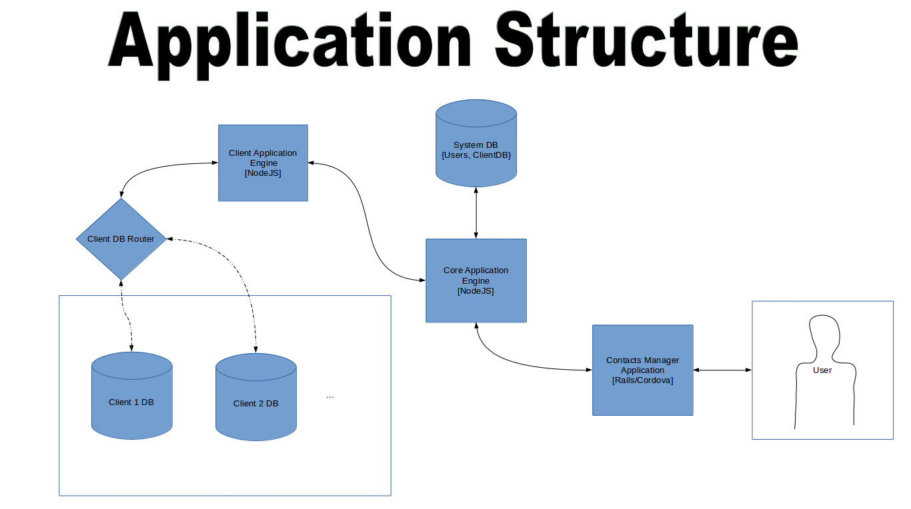

<h3>Contact Manager Prototype</h3>

Contact Manager Prototype is multi-tenant application that allows users to manage their contacts. Inspired by Eloqua and Salesforce, the application was built to allow schema to be customizable to suit the needs of different users. This application's <i>[immature]</i> framework aims to solve one of the problems in web development: providing platform as a service to multiple clients while fulfilling client-specific needs. 

As described by the figure above - The user is able to use the application through the browser or using a mobile application. The Core Application Engine, Client Application Engine and Client DB Router are powered by NodeJS. These three pieces work together to manage the users' Application Schema and retrieve users' data from their client database. 

Each user is associated with their own database which becomes available to them when the user creates an account.

The website is built using <b>Ruby On Rails</b> with <b>AngularJS</b>, this was to make the code base similar with the Mobile application which is built using <b>Apache Cordova</b> and <b>Ionic Framework</b>. 

	REST API Guide: Please see the live documentation <a>here</a>.

<blockquote>
Create Account
</blockquote>
<pre>
POST /application/account

	Request: {}

	Response: {}

</pre>

<blockquote>
Sign in to Account
</blockquote>
<pre>
POST /application/account/signin

	Request: {}

	Response: {}

</pre>

<blockquote>
Get Account
</blockquote>
<pre>
GET /application/account/:accountId

	Request: {}

	Response: {}

</pre>

<blockquote>
Update Account
</blockquote>
<pre>
PUT /application/account/:accountId

	Request: {}

	Response: {}

</pre>

<blockquote>
Create CustomObject
</blockquote>
<pre>
POST /application/account/:accountId/customObject

	Request: {}

	Response: {}

</pre>

<blockquote>
Update CustomObject
</blockquote>
<pre>
PUT /application/account/:accountId/customObject/:customObjectId

	Request: {}

	Response: {}

</pre>

<blockquote>
Delete CustomObject
</blockquote>
<pre>
DELETE /application/account/:accountId/customObject/:customObjectId

	Request: {}

	Response: {}

</pre>

<blockquote>
Search CustomObjects
</blockquote>
<pre>
GET /application/account/:accountId/customObjects?name={name}&description={description}

	Request: {}

	Response: {}

</pre>

<blockquote>
Get CustomObject
</blockquote>
<pre>
GET /application/account/:accountId/customObject/:customObjectId

	Request: {}

	Response: {}

</pre>

<blockquote>
Get CustomObject ModelDefinitions
</blockquote>
<pre>
GET /application/account/:accountId/customObject/:customObjectId/modelDefinitions

	Request: {}

	Response: {}

</pre>

<blockquote>
Get CustomObject ModelDefinition
</blockquote>
<pre>
GET /application/account/:accountId/customObject/:customObjectId/modelDefinition/:customObjectModelDefinitionId

	Request: {}

	Response: {}

</pre>

<blockquote>
Create CustomObject ModelDefinitions
</blockquote>
<pre>
POST /application/account/:accountId/customObject/:customObjectId/modelDefinition

	Request: {}

	Response: {}

</pre>

<blockquote>
Update CustomObject ModelDefinitions
</blockquote>
<pre>
PUT /application/account/:accountId/customObject/:customObjectId/modelDefinition/:customObjectModelDefinitionId

	Request: {}

	Response: {}

</pre>

<blockquote>
Delete CustomObject ModelDefinition
</blockquote>
<pre>
DELETE /application/account/:accountId/customObject/:customObjectId/modelDefinition/:customObjectModelDefinitionId

	Request: {}

	Response: {}

</pre>
 
<blockquote>
Create CustomObjectData
</blockquote>
<pre>
POST /application/account/:accountId/customObject/:customObjectId/data

	Request: {}

	Response: {}

</pre>

<blockquote>
Search CustomObjectData
</blockquote>
<pre>
POST /application/account/:accountId/customObject/:customObjectId/data/search

	Request: {}

	Response: {}

</pre>

<blockquote>
Get CustomObjectData
</blockquote>
<pre>
GET /application/account/:accountId/customObject/:customObjectId/data/:customObjectDataId

	Request: {}

	Response: {}

</pre>

<blockquote>
Update CustomObjectData
</blockquote>
<pre>
PUT /application/account/:accountId/customObject/:customObjectId/data/:customObjectDataId

	Request: {}

	Response: {}

</pre>

<blockquote>
Delete CustomObjectData
</blockquote>
<pre>
DELETE /application/account/:accountId/customObject/:customObjectId/data/:customObjectDataId

	Request: {}

	Response: {}

</pre>

Flow:
AuthApp, AuthAcc, Parse Request, Map Request Object to Model, Validate, Perform CRUD

Validation:
Validation at this time only exists for CustomObject and CustomObjectData mapping, but no custom validation yet. 

Roadmap:
Validations for models. Js library will be exposed. 

Concerns:
Since this is a prototype, there is no encryption of passwords or proper application level authentication. This can be added into the application source code. 

